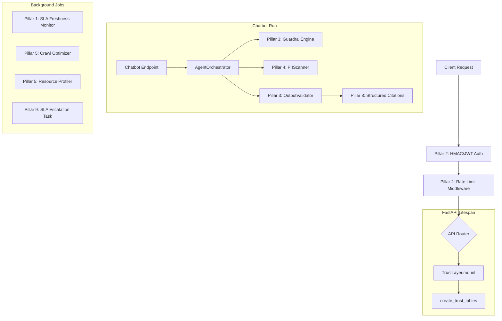

# 🛡️ Trustworthy AI Framework - Implementation Summary

A production-grade, nine-pillar **Trustworthy AI Governance Framework** has been integrated into the Macro Intelligence Platform. This framework aligns the platform with international and enterprise compliance standards, including **GDPR**, **SOX**, **MiFID II**, and internal AI safety guidelines.

---

## 🏗️ Architecture & Integration

The framework is orchestrating 22 pillar-specific endpoints, rate-limiting middleware, and 22 custom database tables.



### 1. API Mounting
The system utilizes a single integration hook, `TrustLayer.mount(app)`, inside [src/api/main.py](file:///C:/Users/Tarun/Documents/macro-platform/src/api/main.py#L62-L63). This registers Starlette middleware (`RateLimitMiddleware`) and mounts the 22 FastAPI routers for each governance metric.

### 2. Lifespan Database Migration
At startup, `create_trust_tables()` is called inside the lifespan hook of [src/api/main.py](file:///C:/Users/Tarun/Documents/macro-platform/src/api/main.py#L26-L30). It runs idempotent database migrations defined in [trust/database/migrations.py](file:///C:/Users/Tarun/Documents/macro-platform/trust/database/migrations.py) to provision the schema.

---

## 📊 Detailed Analysis of the Nine Pillars

### 1. 📈 Reliability
*   **Purpose**: Manages system availability, data freshness, and LLM output confidence.
*   **Key Modules**:
    *   [trust/reliability/retry_policy.py](file:///C:/Users/Tarun/Documents/macro-platform/trust/reliability/retry_policy.py): Implements a custom `RetryPolicy` and `CircuitBreaker` pattern to handle transient downstream failures and prevent cascading microservice outages.
    *   [trust/reliability/health_check.py](file:///C:/Users/Tarun/Documents/macro-platform/trust/reliability/health_check.py): Exposes a standard `/health` and deep `/health/deep` validation endpoints.
    *   [trust/reliability/sla_monitor.py](file:///C:/Users/Tarun/Documents/macro-platform/trust/reliability/sla_monitor.py): Monitors SLA indicator data freshness based on three defined compliance windows (Tier 1: 15 minutes, Tier 2: 2 hours, Tier 3: 24 hours) for MiFID II regulation.
    *   [trust/reliability/extraction_thresholds.py](file:///C:/Users/Tarun/Documents/macro-platform/trust/reliability/extraction_thresholds.py): Implements a decision engine for LLM confidence: `AUTO_ACCEPT` ($\ge 0.90$), `QUEUE_REVIEW` ($0.70$ - $0.90$), and `REJECT` ($< 0.70$).
*   **Database Tables**: `sla_violations`, `extraction_decisions`.

### 2. 🔒 Security
*   **Purpose**: Protects project endpoints and resource access while managing crawl rates.
*   **Key Modules**:
    *   [trust/security/auth.py](file:///C:/Users/Tarun/Documents/macro-platform/trust/security/auth.py): Implements HMAC-SHA256 API Key authorization with bcrypt storage. Enforces Azure AD RS256 JWT signature verification over live JWKS (repaired previous insecure verification bypasses).
    *   [trust/security/rate_limiter.py](file:///C:/Users/Tarun/Documents/macro-platform/trust/security/rate_limiter.py): A custom token-bucket rate limiter backing limits by PostgreSQL to govern requests based on user roles (`PUBLIC`, `EXTERNAL_BUSINESS`, `INTERNAL_ANALYST`, `ADMIN`, `DATA_GOVERNANCE`).
    *   [trust/security/bot_detection.py](file:///C:/Users/Tarun/Documents/macro-platform/trust/security/bot_detection.py): Implements request header rotation and registers crawling crawler bot blocks with escalating cooldown windows (1 hour, 4 hours, 24 hours) leading to permanent blocks on the third strike.
    *   [trust/security/secret_manager.py](file:///C:/Users/Tarun/Documents/macro-platform/trust/security/secret_manager.py): Hides raw configurations and outputs masked versions of API secrets.
*   **Database Tables**: `api_keys`, `rate_limit_buckets`, `blocked_sources`.

### 3. 🛡️ Safety
*   **Purpose**: Prevents off-topic interactions, halts unauthorized financial projections, and audits outputs.
*   **Key Modules**:
    *   [trust/safety/guardrails.py](file:///C:/Users/Tarun/Documents/macro-platform/trust/safety/guardrails.py): Contains the `GuardrailEngine` running query filtering. Blocks out-of-scope prompts (using a curated whitelist of macro topics) and investment advice requests (triggering refusals). Inserts a disclaimer if future forecasting terms are generated.
    *   [trust/safety/output_validator.py](file:///C:/Users/Tarun/Documents/macro-platform/trust/safety/output_validator.py): Inspects generated lengths and uses structured data assertions to cross-check LLM statistics against facts loaded in the Gold table layer.
*   **Database Tables**: `guardrail_audit_log`.

### 4. 🕵️ Privacy
*   **Purpose**: Sanitizes PII, secures cookie consent, and provides erasure channels.
*   **Key Modules**:
    *   [trust/privacy/pii_scanner.py](file:///C:/Users/Tarun/Documents/macro-platform/trust/privacy/pii_scanner.py): Strips out identifiers like credit cards, phone numbers, emails, and SSNs from prompts using regex match sequences.
    *   [trust/privacy/consent_manager.py](file:///C:/Users/Tarun/Documents/macro-platform/trust/privacy/consent_manager.py): Validates and logs compliance permissions while masking identifying user info. Securely stores deterministic SHA-256 hashes of user IDs and IP addresses to avoid storing raw PII.
    *   [trust/privacy/data_retention.py](file:///C:/Users/Tarun/Documents/macro-platform/trust/privacy/data_retention.py): Orchestrates an automatic scheduler job to purge logs beyond the compliance period (daily maintenance checks).
*   **Database Tables**: `privacy_audit_log`, `user_consents`, `retention_audit_log`.

### 5. 🌱 Sustainability
*   **Purpose**: Tracks storage metrics, schedules optimized crawl rates, and alerts resource footprints.
*   **Key Modules**:
    *   [trust/sustainability/cost_tracker.py](file:///C:/Users/Tarun/Documents/macro-platform/trust/sustainability/cost_tracker.py): Calculates active operational spending per source for LLM operations ($/1k tokens), storage modifications ($/GB), and network requests.
    *   [trust/sustainability/crawl_optimizer.py](file:///C:/Users/Tarun/Documents/macro-platform/trust/sustainability/crawl_optimizer.py): Prevents wasteful duplicate ingestion tasks by checking ETag headers and content hash signatures.
    *   [trust/sustainability/resource_profiler.py](file:///C:/Users/Tarun/Documents/macro-platform/trust/sustainability/resource_profiler.py): Measures storage footprints across Bronze, Silver, and Gold relational tables every 6 hours.
*   **Database Tables**: `cost_tracking`, `crawl_opt_log`, `resource_metrics`.

### 6. 🔍 Explainability
*   **Purpose**: Logs extraction traces and exposes calculations for score breakdowns.
*   **Key Modules**:
    *   [trust/explainability/source_selector.py](file:///C:/Users/Tarun/Documents/macro-platform/trust/explainability/source_selector.py): Records logs details of why a particular source was chosen when resolving data.
    *   [trust/explainability/anomaly_explainer.py](file:///C:/Users/Tarun/Documents/macro-platform/trust/explainability/anomaly_explainer.py): Generates clear explanations for variations like out-of-range, value conflict, and data revision anomalies.
    *   [trust/explainability/llm_trace.py](file:///C:/Users/Tarun/Documents/macro-platform/trust/explainability/llm_trace.py): Tracks the prompt, excerpt, extracted JSON, model version, tokens, and latency for LLM actions to comply with SOX auditing.
    *   [trust/explainability/quality_score_breakdown.py](file:///C:/Users/Tarun/Documents/macro-platform/trust/explainability/quality_score_breakdown.py): Computes quality metric coefficients using the formula:
        $$\text{Score} = (\text{Accuracy} \times 0.40) + (\text{Completeness} \times 0.30) + (\text{Timeliness} \times 0.20) + (\text{Consistency} \times 0.10)$$
*   **Database Tables**: `explainability_log`, `llm_extraction_traces`.

### 7. 🎯 Data Quality
*   **Purpose**: Validates incoming feeds, resolves conflicts, and tracks history.
*   **Key Modules**:
    *   [trust/data_quality/validator.py](file:///C:/Users/Tarun/Documents/macro-platform/trust/data_quality/validator.py): Filters data feeds through a four-stage validator checking schema rules, numeric ranges, cross-indicator consistency, and freshness.
    *   [trust/data_quality/conflict_resolver.py](file:///C:/Users/Tarun/Documents/macro-platform/trust/data_quality/conflict_resolver.py): Resolves multi-source data variances. Classifies variances $<1\%$ as `ROUTINE` and auto-selects the source with the highest reliability rating. Deviations $>5\%$ are labeled `MAJOR` and routed to the manual review queue.
    *   [trust/data_quality/revision_tracker.py](file:///C:/Users/Tarun/Documents/macro-platform/trust/data_quality/revision_tracker.py): Tracks history, logging changes and flagging revisions exceeding $10\%$ as significant.
    *   [trust/data_quality/scorecard.py](file:///C:/Users/Tarun/Documents/macro-platform/trust/data_quality/scorecard.py): Computes weekly reputation scorecards for each source based on its historical quality.
*   **Database Tables**: `conflict_log`, `indicator_revisions`, `source_scorecards`.

### 8. 📖 Transparency
*   **Purpose**: Provides citations and traces provenance paths.
*   **Key Modules**:
    *   [trust/transparency/chatbot_citations.py](file:///C:/Users/Tarun/Documents/macro-platform/trust/transparency/chatbot_citations.py): Regulates generated chatbot citations. Re-prompts the LLM if it fails to include source attributions. Adds dynamic citation links linking to the source record.
    *   [trust/transparency/citation_trail.py](file:///C:/Users/Tarun/Documents/macro-platform/trust/transparency/citation_trail.py): Maps data provenance across three levels: ingestion, cleaning, and serving.
    *   [trust/transparency/governance_artefacts.py](file:///C:/Users/Tarun/Documents/macro-platform/trust/transparency/governance_artefacts.py): Houses the version-controlled governance policies.
*   **Database Tables**: `citation_trails`, `governance_policies`.

### 9. ⚖️ Fairness & Accountability
*   **Purpose**: Audits geographic representation, assigns reviewer tasks, and flags region bias.
*   **Key Modules**:
    *   [trust/fairness/coverage_disclosure.py](file:///C:/Users/Tarun/Documents/macro-platform/trust/fairness/coverage_disclosure.py): Checks coverage depth across country metrics and injects low-coverage warnings if indicator availability falls below $60\%$.
    *   [trust/fairness/bias_monitor.py](file:///C:/Users/Tarun/Documents/macro-platform/trust/fairness/bias_monitor.py): Monitors user query diversity across different sessions to identify regional biases.
    *   [trust/fairness/human_oversight.py](file:///C:/Users/Tarun/Documents/macro-platform/trust/fairness/human_oversight.py): Directs ingested records to appropriate pipelines based on quality scores: Auto-Approve ($\ge 90$), Review Queue ($70$ - $90$), or Auto-Reject ($< 70$).
    *   [trust/fairness/accountability_chain.py](file:///C:/Users/Tarun/Documents/macro-platform/trust/fairness/accountability_chain.py): Manages a 5-tier escalation chain for review tasks. Assigns SLA response deadlines per level and handles automated task escalations.
*   **Database Tables**: `bias_alerts`, `accountability_tasks`, `oversight_approvals`.

---

## 🛠️ Chatbot Citation & Lineage Refinements

A key reliability enhancement was introduced in [src/agents/runtime/citations.py](file:///C:/Users/Tarun/Documents/macro-platform/src/agents/runtime/citations.py).

Citations are now dynamically compiled directly from the structured `ToolResult` metadata returned during tool execution, rather than relying on regex parsing of the LLM's generated response.
This modification:
1.  **Eliminates Formatting Drift**: Prevents errors if the model omits or formats the `[Source: ...]` tags incorrectly.
2.  **Guarantees Attribution**: Ensures that the citation list is a reliable record of the data retrieved by the agent.

The agent run results in [src/agents/chatbot.py](file:///C:/Users/Tarun/Documents/macro-platform/src/agents/chatbot.py#L153-L163) were updated to return the structured `context_records` and `citations` array derived from this lineage track.

---

## 🧪 Integration Testing Suite

A complete integration testing suite has been implemented in [tests/test_trust_integration.py](file:///C:/Users/Tarun/Documents/macro-platform/tests/test_trust_integration.py) containing **35 test cases** that validate the end-to-end performance of each pillar. 

To run the compliance suite, execute:
```pwsh
pytest tests/test_trust_integration.py -v
```
